# Sistema de Reservas - Pousada

### Contexto
- Este projeto foi desenvolvido como requisito da disciplina de Linguagem de Programação do Curso de Análise e Desenvolvimento de Sistemas da Faculdade de Tecnologia de Mogi Mirim e teve como objetivo proporcionar a prática e aplicação dos conceitos aprendidos em sala de aula, abordando temas como estruturas de controle, funções e manipulação de dados por meio da linguagem C.

### Como Iniciar a Aplicação
- Abrir a pasta onde está localizado o projeto dentro da IDE.
- Clicar no icone 'Run' (seta verde, no canto superior direito).

### Como Utilizar (Usuário final)
- Ao iniciar a aplicação o menu principal será apresentado, ele foi projetado para oferecer uma experiência simples e intuitiva aos usuários.
- Uma mensagem de boas vindas será exibida, conforme imagem abaixo:

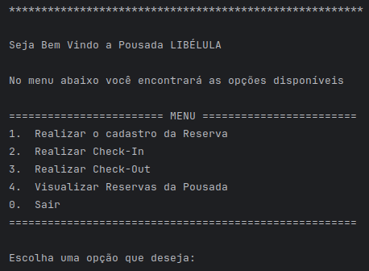

- Após escolher o número da opção desejada, pressione a tecla 'Enter' para dar continuidade ao processo, seguindo as instruções fornecidas pelo programa para cada operação.

### Funcionalidades

#### Opção '1' do menu principal:
- O sistema verificar automaticamente se a capacidade máxima de reservas já foi efetuadas, isto é, 10 quartos. 
- Caso exceda este limite, será exibida a mensagem, conforme imagem abaixo:

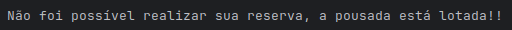

- Caso haja vagas o sistema permite o cadastro de uma reserva, para isto, deverá fornecer informações: nome completo, número de hóspede, número de dias de permanência na pousada, CPF, DDD, telefone e cidade. 
- Com todas as informações completas o cadastro é realizado, um número de quarto livre será atribuído.
- A reserva é registrada no sistema e a confirmação é exibida, conforme imagem abaixo: 

  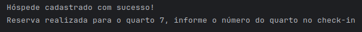

#### Opção '2' do menu principal:

- O usuário informa o número do quarto atribuido durante a reserva.
- Será necessario confirmar o nome da reserva. O sistema aceitará as entradas 'S' e 'N' em maiúsculo ou minúsculo, conforme imagem abaixo:
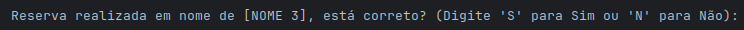
   
- Caso 'S' confirmando, o status da reserva será atualizado e a mensagem exibida, conforme imagem abaixo:
  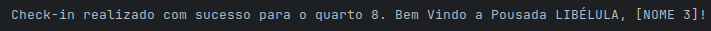
 
- Caso 'N' negativo, o sistema exibirá a mensagem, conforme imagem abaixo:
  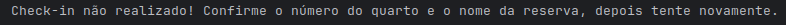 

- O sistema permite o check-in apenas para uma reserva existente.
- Caso o usuário entre com o número incorreto do quarto, será exibida a mensagem, conforme imagem abaixo:
   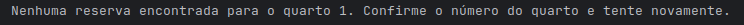

#### Opção '3' do menu principal:

- O número do quarto deverá ser indicado corretamente pelo usuário.
- O usuário será questionado quanto ao possível consumo de itens do frigobar, conforme imagem abaixo:
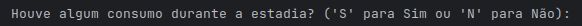
- Caso 'S' confirmando, serão exibidos o menu frigobar, conforme imagem abaixo:

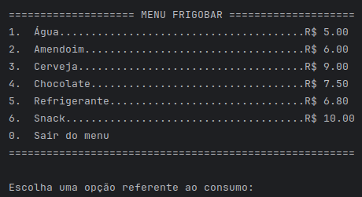

- O usuário deverá indicar quais foram os itens consumidos de acordo com o número correspondente do menu frigobar, para que assim o sistema calcule os gastos e some-os com o valor da estadia. 
- Em caso de consumo duplicado de itens, será necessário inserir as opções correspondentes de forma repetida.
- Logo após a indicação de consumo, o usuário deverá digitar a opção '0' para fechar a conta.
- O cálculo referente ao valor das diárias será realizado, sendo R$ 180,00 por dia de hospedagem, com um acréscimo de R$ 50,00 por dia, para cada hóspede adicional. 
- A nota fiscal será exibida contendo a somatória das diárias e do consumo, conforme imagem abaixo:
   
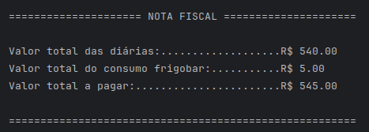

- Caso 'N' negativo para consumo de itens do frigobar.
- O cálculo referente ao valor das diárias será realizado, sendo R$ 180,00 por dia de hospedagem, com um acréscimo de R$ 50,00 por dia, para cada hóspede adicional.
- A nota fiscal será exibida contendo somente a somatória das diárias, conforme imagem abaixo:
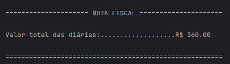

- Em ambas as opções (com ou sem consumo), ao fechar a conta o status da reserva será atualizado e o quarto ficará 'Livre' aguardando uma nova reserva.
- Uma mensagem de confirmação de check-out será exibida, conforme imagem abaixo:

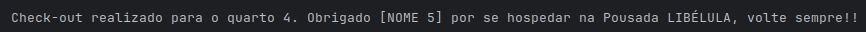

- O sistema permite o check-out apenas para o quarto que tenha um check-in existente.
- Caso o usuário entre com o número incorreto do quarto, será exibida a mensagem, conforme imagem abaixo:

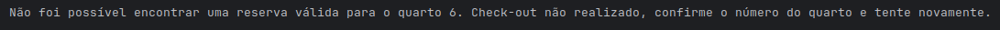

#### Opção '4' do menu principal:
- Será exibida uma relação com o status da ocupação de todos dos quartos no momento, estando eles 'Livre', 'Reservado' ou 'Check-in', incluindo o nome dos hóspedes e os dias reservados, conforme imagem abaixo:

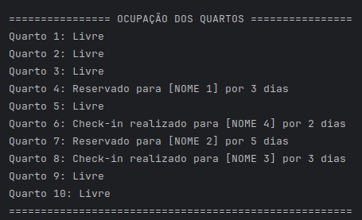

#### Opção '0' do menu principal:
Ao escolher a opção '0' do menu principal, o programa é encerrado, será exibida a mensagem, conforme imagem abaixo:

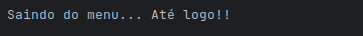

#### Opção 'inválida' do menu principal:
- Caso uma entrada inválida seja detectada, será exibida a mensagem, conforme imagem abaixo:

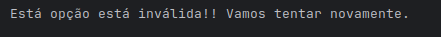

### Authors
- Bruna Letícia dos Santos [@Bruna-Leticia12](https://github.com/Bruna-Leticia12)
- Bruna Marques Zirpoli Secondo [@Brunasecondo](https://github.com/Brunasecondo/brunasecondo.git)
- Nathalie Assis de Souza @NathAssis [@NathAssis](https://github.com/NathAssis)